# GCP Software Supply Chain & Runtime Security

[](https://cloud.google.com/)
[](https://www.terraform.io/)
[](https://github.com/features/actions)
[](https://kubernetes.io/)
[](https://www.sigstore.dev/)
[](https://falco.org/)

This repository demonstrates a defense-in-depth container delivery path on GCP: code is checked before merge, trusted main-branch builds establish artifact identity, and Kubernetes verifies that identity again before a workload is admitted. A FastAPI reference service is built into a hardened container, scanned, pushed to Artifact Registry, signed keylessly with Cosign, enriched with SPDX SBOM and SLSA provenance attestations, and verified before a reviewed GitOps promotion.

Argo CD reconciles digest-pinned desired state into GKE. Kyverno enforces the configured signature, SBOM, provenance, Rekor, and digest requirements at admission time; Falco provides a separate runtime-detection layer after a Pod has started. This is a DevSecOps and software-supply-chain-security project, not a platform-engineering implementation.

> **Live evidence status:** the repository contains verified GitHub Actions, Artifact Registry, GKE, Argo CD, Kyverno, and Falco results. Each live validation is placed beside the control it proves below. The Argo CD captures are redacted only where they contained personal account metadata; all screenshots were reviewed to exclude credentials, tokens, keys, and webhooks.

## Contents

- [Why This Project Exists](#why-this-project-exists)
- [Architecture](#architecture)
- [Security Model](#security-model)
- [Pull Request Security](#pull-request-security)
- [Trusted Main-Branch Pipeline](#trusted-main-branch-pipeline)
- [Artifact Trust](#artifact-trust)
- [GitOps Deployment and Admission Control](#gitops-deployment-and-admission-control)
- [Runtime Security](#runtime-security)
- [Security Tests: What Happens When Trust Breaks?](#security-tests-what-happens-when-trust-breaks)
- [Live Validation Evidence](#live-validation-evidence)
- [Repository Structure](#repository-structure)
- [Infrastructure](#infrastructure)
- [Azure Startup](#azure-startup)
- [CI/CD Workflows](#cicd-workflows)
- [Reproduce or Inspect Safely](#reproduce-or-inspect-safely)
- [Threat Model and Boundaries](#threat-model-and-boundaries)
- [Design Decisions](#design-decisions)
- [Current Scope and Future Improvements](#current-scope-and-future-improvements)
- [Cost and Cleanup](#cost-and-cleanup)
- [What This Project Demonstrates](#what-this-project-demonstrates)
- [Upstream Attribution](#upstream-attribution)

## Why This Project Exists

Container security is more than a successful image build. A useful delivery system needs to answer several different questions:

| Question | Control in this project |
| --- | --- |
| Did a relevant code change pass security checks before merge? | Semgrep, Trivy filesystem scanning, policy regression tests, and a local PR image scan |
| Which cloud identity pushed the image? | GitHub OIDC exchanged through GCP Workload Identity Federation |
| Which exact artifact was reviewed? | Immutable OCI digest, not a mutable tag |
| Who signed it and where did it come from? | Cosign keyless certificate identity, Rekor evidence, SPDX SBOM, and SLSA provenance |
| Can an untrusted image reach the cluster? | Kyverno Enforce policy at Kubernetes admission |
| What happens after an approved workload starts? | Falco runtime detection and Falcosidekick routing |

The project deliberately separates preventive controls from detective controls. Admission control can stop an image that does not meet a defined trust contract; it cannot determine whether an admitted process later opens an interactive shell. Falco fills that post-admission visibility gap.

## Architecture

### End-to-end security architecture

~~~mermaid
flowchart TD
  Dev[Developer] --> PR[Pull request]
  Dev --> Main[Trusted merge to main]

  subgraph PRS[PR security]
    PR --> Changes[Relevant-change detection]
    Changes --> Semgrep[Semgrep SAST]
    Changes --> TrivyFS[Trivy filesystem scan]
    Changes --> PolicyTests[Identity and policy tests]
    Changes --> PRImage[Local Docker build and Trivy image scan]
  end

  subgraph TCI[Trusted CI on main]
    Main --> OIDC[GitHub OIDC]
    OIDC --> WIF[GCP Workload Identity Federation]
    WIF --> Build[Build and push to Artifact Registry]
    Build --> FinalScan[Trivy scan of exact digest]
    FinalScan --> Sign[Cosign keyless signature]
    FinalScan --> SBOM[SPDX SBOM attestation]
    FinalScan --> Provenance[SLSA provenance attestation]
  end

  subgraph TRUST[Artifact trust]
    Sign --> Verify[Fail-closed CI verification]
    SBOM --> Verify
    Provenance --> Verify
  end

  subgraph GITOPS[Reviewed deployment state]
    Verify --> Pin[Manual reviewed digest pin]
    Pin --> Argo[Argo CD reconciliation]
  end

  subgraph ADMISSION[Admission security]
    Argo --> Kyverno[Kyverno Enforce]
    Kyverno --> Admit[Trusted digest admitted]
    Kyverno --> DenyUnsigned[Unsigned image denied]
    Kyverno --> DenyIdentity[Wrong identity or provenance denied]
    Kyverno --> DenyInit[Unsigned initContainer denied]
  end

  subgraph RUNTIME[Runtime security]
    Admit --> GKE[Running GKE workload]
    GKE --> Falco[Falco modern eBPF detection]
    Falco --> Rule[Custom shell-execution rule]
    Falco --> Sidekick[Falcosidekick]
    Sidekick --> OptionalAlert[Optional external alerting]
  end
~~~

The trusted CI path and the deployed Git state are intentionally separated. CI verifies an immutable artifact first; a human then reviews and pins that verified digest in Helm values. Argo CD reconciles that committed desired state, and Kyverno independently evaluates the image at admission.

### Trust and identity chain

~~~mermaid
flowchart TD
  Repo[devSatym/gcp-supply-chain-security] --> MainWorkflow[Main signing workflow]
  Repo --> Policy[Kyverno trust policy]

  MainWorkflow --> OIDCToken[GitHub OIDC token]
  OIDCToken --> WIF[GCP Workload Identity Federation]
  WIF --> CIIdentity[Dedicated CI service account]
  CIIdentity --> GAR[Artifact Registry image by digest]

  MainWorkflow --> Cert[Cosign keyless certificate identity]
  MainWorkflow --> SPDX[SPDX SBOM]
  MainWorkflow --> SLSA[SLSA provenance]

  Cert --> Signature[Signature and Rekor proof]
  SPDX --> Inventory[Package inventory]
  SLSA --> Builder[Builder identity]
  SLSA --> Entry[Workflow entry point]
  SLSA --> Source[Canonical source URI and revision]

  GAR --> KyvernoChecks[Kyverno admission checks]
  Policy --> KyvernoChecks
  Signature --> KyvernoChecks
  Inventory --> KyvernoChecks
  Builder --> KyvernoChecks
  Entry --> KyvernoChecks
  Source --> KyvernoChecks
  KyvernoChecks --> Decision{Trust contract satisfied?}
  Decision -->|Yes| Allow[Admit Pod]
  Decision -->|No| Reject[Deny Pod]
~~~

The normal CI path contains no committed service-account JSON key or Cosign private key. GitHub Actions obtains a short-lived identity through OIDC and Workload Identity Federation; Cosign uses the workflow identity for keyless signing.

### Kubernetes security tree

~~~mermaid
flowchart TD
  Cluster[GKE cluster] --> ArgoCD[Argo CD]
  Cluster --> KyvernoEngine[Kyverno]
  Cluster --> Workload[Supply-chain-demo workload]
  Cluster --> FalcoEngine[Falco]

  ArgoCD --> Desired[Git desired state]
  Desired --> Helm[Helm chart]
  Helm --> Digest[repository at immutable digest]

  KyvernoEngine --> SigCheck[Signature verification]
  KyvernoEngine --> SBOMCheck[SPDX attestation verification]
  KyvernoEngine --> ProvCheck[Provenance verification]
  KyvernoEngine --> PodFields[Pod image-field coverage]
  PodFields --> Containers[containers]
  PodFields --> Init[initContainers]

  Digest --> Workload
  SigCheck --> Workload
  SBOMCheck --> Workload
  ProvCheck --> Workload

  FalcoEngine --> RuleSet[Custom Falco rules]
  FalcoEngine --> EBPFD[Modern eBPF events]
  RuleSet --> SidekickRoute[Falcosidekick]
~~~

### Admission failure paths

~~~mermaid
flowchart TD
  Incoming[Pod reaches Kubernetes admission] --> Scope{Protected GAR image?}
  Scope -->|No| OtherPolicy[Handled by other applicable policy]
  Scope -->|Yes| Signature{Trusted keyless signature and Rekor proof?}
  Signature -->|No| SigDeny[DENY]
  Signature -->|Yes| SBOM{Trusted SPDX attestation?}
  SBOM -->|No| SBOMDeny[DENY]
  SBOM -->|Yes| Provenance{Expected builder, workflow, and source?}
  Provenance -->|No| ProvDeny[DENY]
  Provenance -->|Yes| PodImages{All relevant Pod image fields trusted?}
  PodImages -->|No| InitDeny[DENY]
  PodImages -->|Yes| AdmitPod[ADMIT]
  AdmitPod --> RuntimeWatch[Falco monitors runtime behavior]
~~~

## Security Model

| Layer | What it protects | Why it exists | Example attack or failure addressed |
| --- | --- | --- | --- |
| 1. Source and PR checks | Changed source, dependencies, policy files, and local image output | Find issues before trusted cloud access is available | A code-pattern finding, high/critical filesystem finding, or policy regression blocks a relevant PR |
| 2. Cloud authentication | CI access to Artifact Registry | Replaces long-lived CI credentials with short-lived repository-scoped identity | A copied JSON key is not required for the normal CI path |
| 3. Artifact integrity | Exact image digest and its signing metadata | A tag is mutable metadata; a digest identifies one OCI artifact | A tag later moving cannot change the digest that was signed or deployed |
| 4. Build evidence | SBOM and provenance associated with the signed digest | Proves the expected workflow created an inventory and provenance statement | An artifact from the wrong workflow or source URI does not meet the trust contract |
| 5. Deployment integrity | Git desired state and Argo CD reconciliation | Keeps the deployed artifact reviewable in Git | Argo reconciles the committed digest rather than a floating latest tag |
| 6. Admission security | Kubernetes Pod admission | Re-checks artifact trust immediately before execution | Unsigned images, wrong identities, and unsigned initContainers are denied |
| 7. Runtime detection | Behavior of admitted processes | Admission is not runtime monitoring | A controlled shell execution triggers a CRITICAL Falco event |

## Pull Request Security

The pull-request path is deliberately non-privileged. For relevant changes, the PR pipeline runs:

- changed-path detection;
- Semgrep SAST using auto rules and SARIF reporting;
- Trivy filesystem scanning for HIGH and CRITICAL findings;
- identity-consistency and Kyverno JMESPath policy tests; and
- a local Docker build plus a Trivy image scan before any registry push.

The local image scan complements the filesystem scan: Trivy filesystem mode assesses repository dependencies/files and secrets, while the built-image scan assesses the final image layers and image configuration that the main pipeline would publish.

Pull requests do **not** receive GCP Workload Identity Federation credentials, push to Artifact Registry, produce trusted signatures or attestations, modify Git desired state, or deploy to GKE. In the current workflow layout, the local PR image scan lives in **Deploy**, so main-only Build and Push, SBOM/VEX, Sign and Attest, and Verify jobs can appear as intentionally skipped on a PR. Those skips are a safety boundary, not failed checks.

### Observed PR gate result

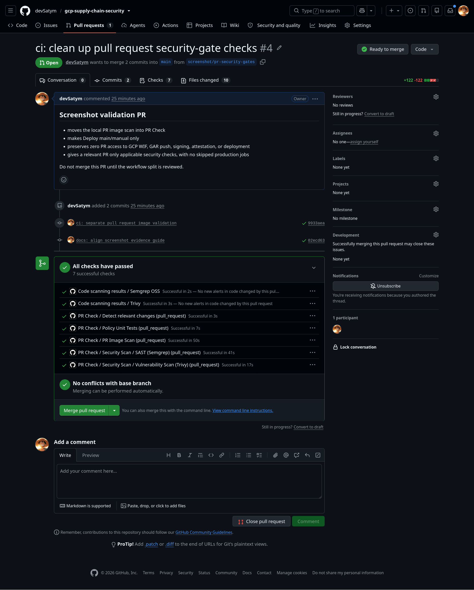

The captured PR shows relevant-change detection, Semgrep, Trivy, policy tests, and a PR image scan completing successfully. It is a validation of the non-privileged PR gate set; it does not grant a pull request production artifact or deployment authority.

## Trusted Main-Branch Pipeline

The trusted main path is:

~~~text
Build and push
  -> Trivy scans the exact immutable registry digest
  -> Cosign signs that digest keylessly
  -> Syft generates an SPDX SBOM
  -> Cosign attaches SPDX and SLSA provenance attestations
  -> CI verifies signature, SBOM, and provenance contracts
  -> a verified digest is manually promoted into Helm desired state
~~~

The final image scan occurs after the artifact is pushed and addresses the exact digest that will be signed. An unsigned registry version can exist briefly at this stage, but it cannot satisfy the Kyverno trust policy because it has no matching signature or attestations.

The **Verify** reusable workflow fails closed. It checks:

- the exact expected image digest and keyless signing identity;
- GitHub Actions as the OIDC issuer;
- the SPDX document predicate and attestation subject digest;
- the SLSA provenance predicate and subject digest;
- GitHub Actions runner builder identity;
- the signing workflow entry point;
- canonical source URI, source commit, and material commit.

The supplementary CycloneDX SBOM and dependency reachability job is explicitly non-blocking and is not the SPDX attestation used by admission control.

### Observed trusted main run

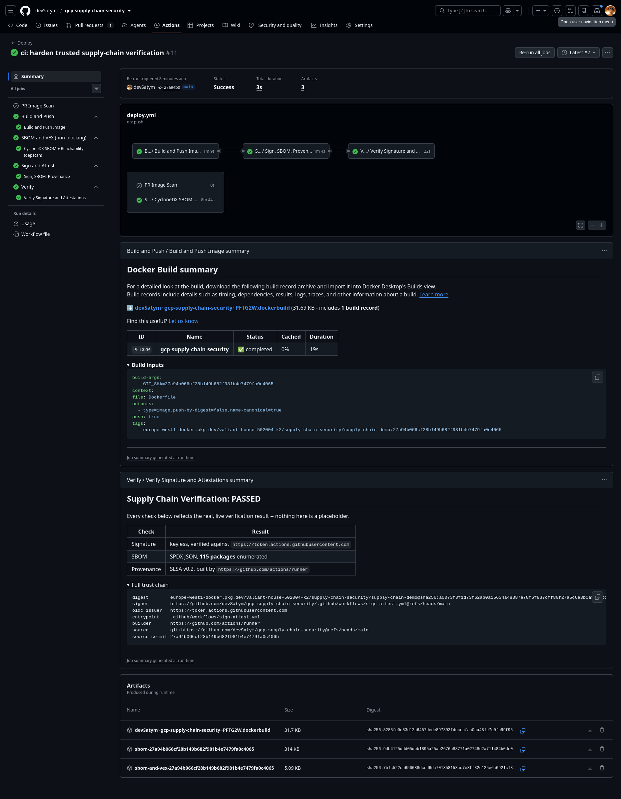

The captured main workflow graph shows **Build and Push**, **Sign and Attest**, and **Verify** succeeding for a main-branch run. The job summary records keyless verification, SPDX package enumeration, and SLSA provenance checks. The exact run is also available at [GitHub Actions run 32638968765](https://github.com/devSatym/gcp-supply-chain-security/actions/runs/32638968765).

## Artifact Trust

### Immutable image identity

Artifact Registry stores the application image. Tags are convenient for humans and build metadata, but the Helm chart deploys the image as:

~~~text
<artifact-registry>/<image>@sha256:<immutable-digest>
~~~

The primary application repository has immutable tags. Cosign legacy signature and attestation indexes use a separate mutable metadata repository because their OCI index tags need append behavior; those metadata entries remain cryptographically bound to the immutable primary image digest.

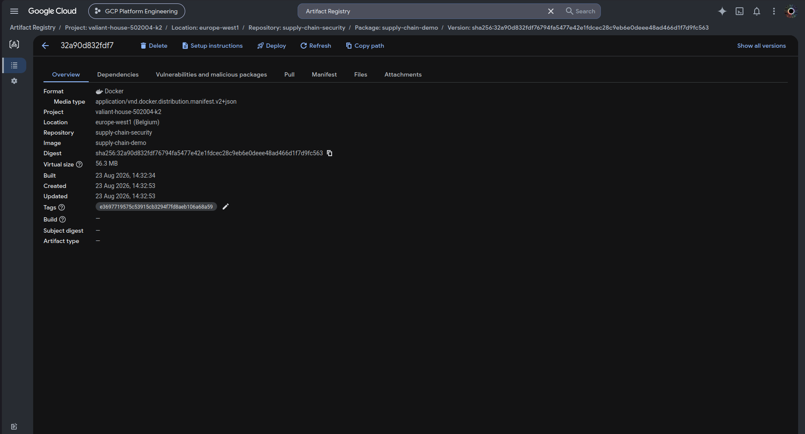

This capture shows a real Artifact Registry image version addressed by digest. The project-specific identifier is deliberately not repeated in the surrounding instructions; the important security property is the immutable digest relationship.

### The running workload uses the reviewed digest

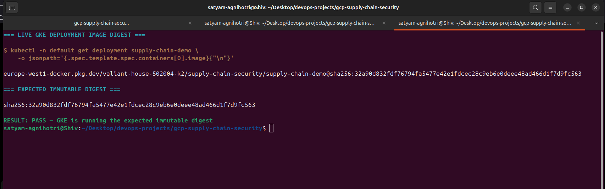

The deployment query returns the same immutable digest recorded as the expected release artifact. This closes an important gap that a registry-only screenshot cannot: the workload actually running in GKE is identified by the reviewed digest, not merely by a convenient image tag.

### Cosign and Sigstore

Cosign signs the exact registry digest with GitHub Actions keyless identity. The expected certificate subject is structurally:

~~~text
https://github.com/devSatym/gcp-supply-chain-security/.github/workflows/sign-attest.yml@refs/heads/main
~~~

The verification contract also expects the GitHub Actions OIDC issuer and normal Rekor-backed transparency-log verification. No private Cosign key is stored in this repository or passed to the workflow.

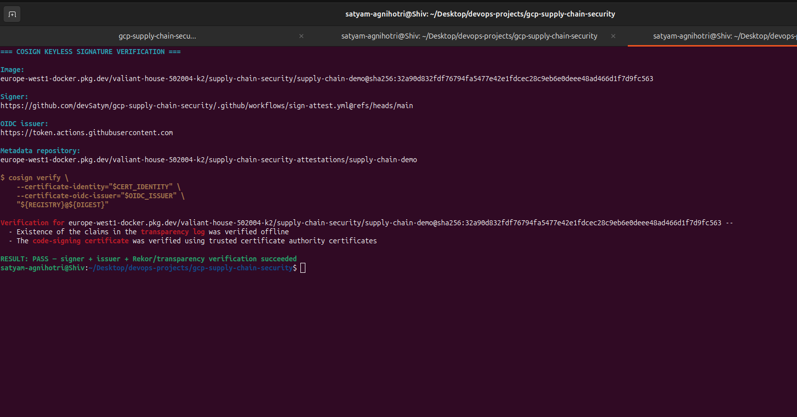

This live `cosign verify` result confirms the expected GitHub Actions workflow identity, OIDC issuer, exact digest, trusted certificate validation, and Rekor/transparency-log proof. It is evidence of a keyless signature verification, not evidence that a private signing key was stored in CI.

### SBOM and SLSA provenance

The two attestations answer different questions:

| Evidence | Question it answers | Implemented producer |
| --- | --- | --- |
| SPDX SBOM | What software packages are in this image? | Syft creates SPDX JSON for the exact image digest; Cosign attaches it as an attestation |
| SLSA provenance | Where and how was this image built? | The signing workflow writes a SLSA v0.2 predicate with builder, source, revision, and workflow-entry-point data |

Kyverno requires the expected signed SPDX and SLSA predicate types. The CI verifier performs stricter contract validation as well, including the source commit and materials. The Kyverno SBOM rule verifies the trusted attestation type and identity; it is not a package-level vulnerability policy.

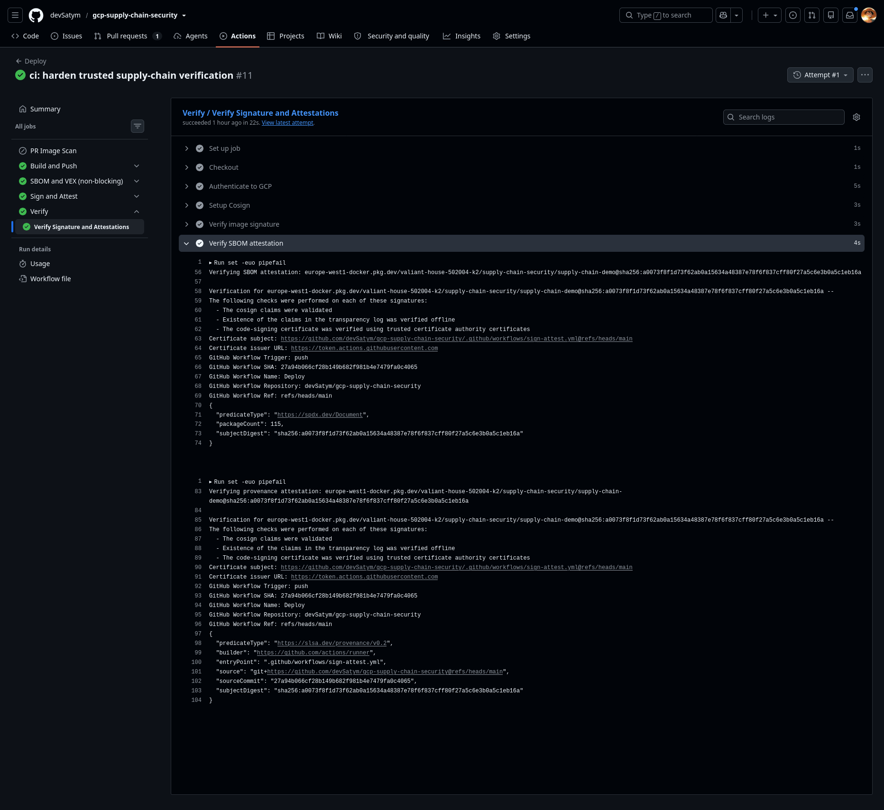

This GitHub Actions verification view shows the SPDX predicate, package count, SLSA provenance predicate, GitHub Actions runner builder, signing-workflow entry point, canonical source URI, source commit, and immutable subject digest.

## GitOps Deployment and Admission Control

### Argo CD and Helm

The active Argo CD Application targets the canonical repository, **main**, and **k8s/helm/supply-chain-demo**. It has automated sync, prune, and self-heal enabled. The chart renders a two-replica Deployment with a digest-pinned image, non-root user, RuntimeDefault seccomp profile, dropped Linux capabilities, read-only root filesystem, resource limits, and health probes.

CI intentionally does not write back to Git. A verified image is promoted through a reviewed manual change to **k8s/helm/supply-chain-demo/values.yaml**. This makes the desired artifact reviewable in the commit that changes deployment state.

Argo CD reconciles Git state; it does not itself perform the cryptographic verification in this design. That enforcement belongs to Kyverno.

### Live cluster health and GitOps reconciliation

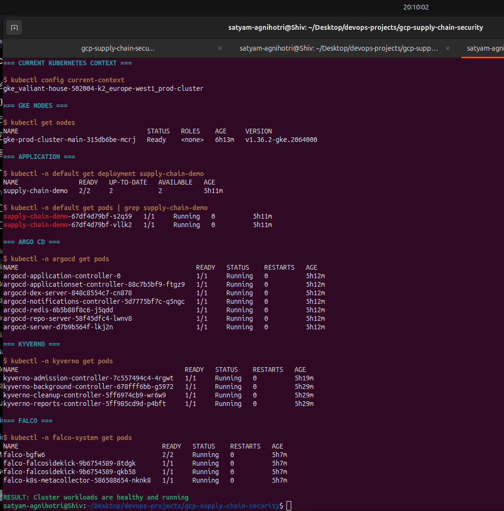

The live cluster evidence shows a Ready node, two available application replicas, and running Argo CD, Kyverno, Falco, and Falcosidekick components. This is supporting infrastructure evidence: it demonstrates that the security controls and the workload were running together in the same cluster.

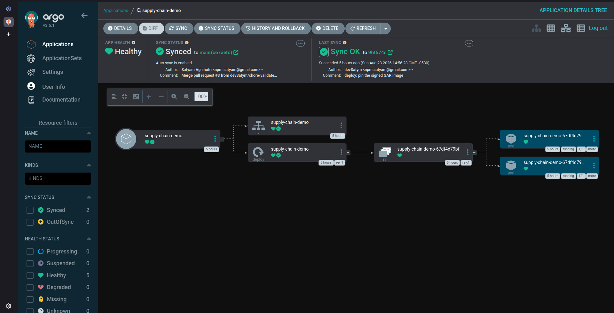

Argo CD reports the application as **Healthy** and **Synced**, with automated synchronization enabled and a resource tree that reaches the two running Pods. Personal account metadata in the status header has been redacted; the health, sync revision, and resource state remain unmodified.

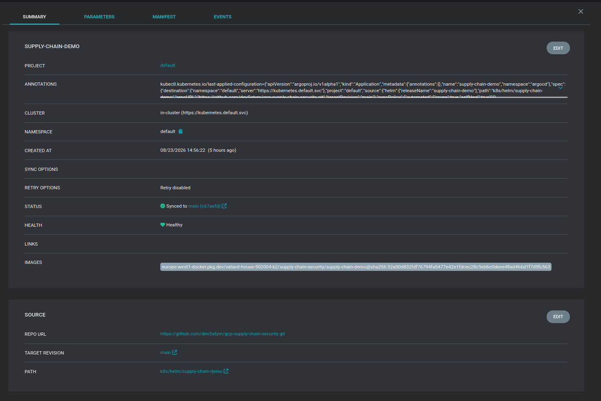

The Application details show the canonical Git repository, `main` target revision, Helm chart path, and digest-pinned image field. This is the GitOps handoff: Git provides desired state, Argo CD reconciles it, and Kyverno evaluates the Pod before it can run.

### Kyverno trust contract

The active **block-unsigned-images** ClusterPolicy is in Enforce mode and contains three concrete rules:

| Rule | Enforced requirement |
| --- | --- |
| **verify-image-signature** | A keyless Cosign signature from the expected signing workflow, GitHub OIDC issuer, and Rekor path |
| **verify-sbom-attestation** | An SPDX Document attestation from the same trusted workflow identity |
| **verify-provenance-attestation** | A SLSA v0.2 attestation with the expected GitHub Actions builder, signing workflow entry point, and canonical source URI |

The policy applies to protected application images in the configured Artifact Registry scope. It uses digest verification, does not mutate a tag to hide the resolved value, and evaluates the relevant Pod image fields. The tested namespace exclusions are explicitly defined in the policy so that cluster system components are not unintentionally held to the application-image contract.

Kyverno reads the application and Cosign metadata repositories through a distinct, repository-scoped GCP service account bound to its Kubernetes service account with GKE Workload Identity. Its Helm values set an 8 MiB context limit because image-attestation evaluation needs sufficient context for real SBOM data.

The negative-test Argo Application is deliberately not automated. It exists as a manual test target so rejected resources are not retried continuously.

### Trusted workload admission evidence

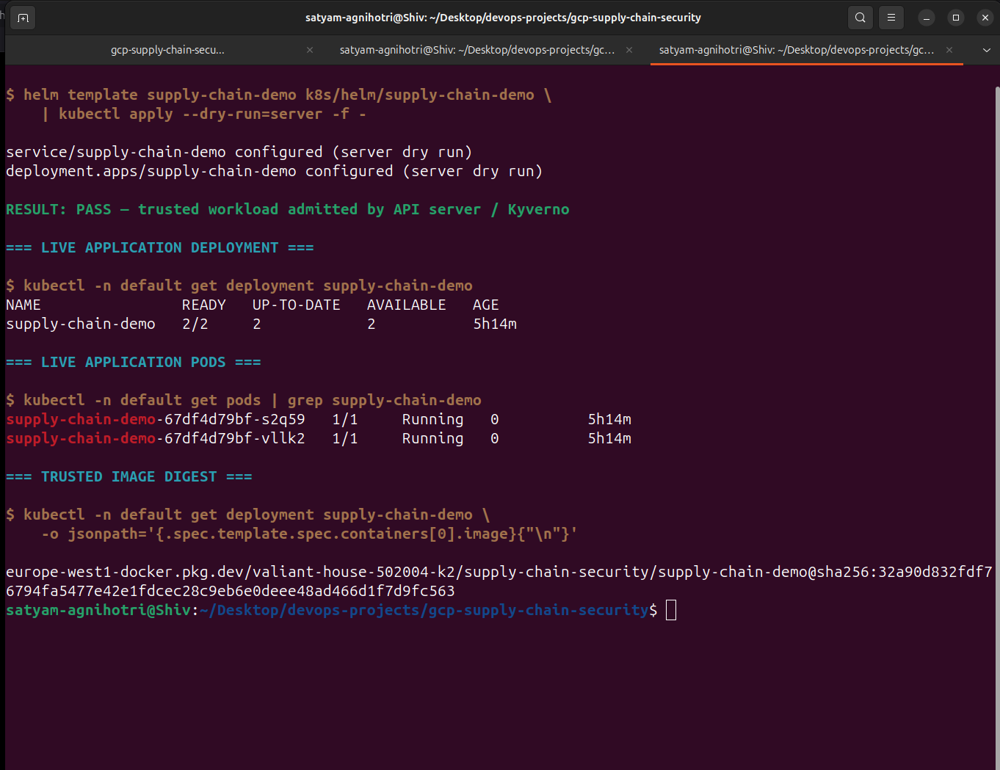

The rendered Helm release passed a **server-side** dry run through the Kubernetes API and Kyverno, then the live Deployment reached two available replicas. The final command also reads the image from the live Deployment, connecting admission success to the pinned trusted digest.

## Runtime Security

| Time | Control | What it does | What it does not claim |
| --- | --- | --- | --- |
| Build and PR time | Semgrep and Trivy | Scans source, filesystem content, and local/final images | Does not prove an image is from the trusted workflow |
| Artifact time | Cosign, SPDX, SLSA | Binds a digest to signing identity, inventory, and build metadata | Does not prove all code is safe or vulnerability-free |
| Admission time | Kyverno | Blocks protected images that do not meet the configured trust contract | Does not observe later process behavior |
| Runtime | Falco | Detects behavior from modern eBPF events and custom rules | Does not prevent the detected shell command from starting |

Falco is Terraform-managed as a DaemonSet using modern eBPF. A custom CRITICAL rule, **Shell Spawned In Signed Workload Pod**, detects shell processes in containers outside the excluded system namespaces. A controlled kubectl exec using /bin/sh -c id generated the expected CRITICAL event against the admitted workload.

Falcosidekick is deployed with the runtime stack. External Pub/Sub to Cloud Function to Discord alert routing is intentionally disabled in the public reference deployment because no real webhook is committed to the repository. When enabled, the design uses Falcosidekick Kubernetes ServiceAccount to GKE Workload Identity to a minimally scoped Pub/Sub publisher role; it does not require a JSON service-account key.

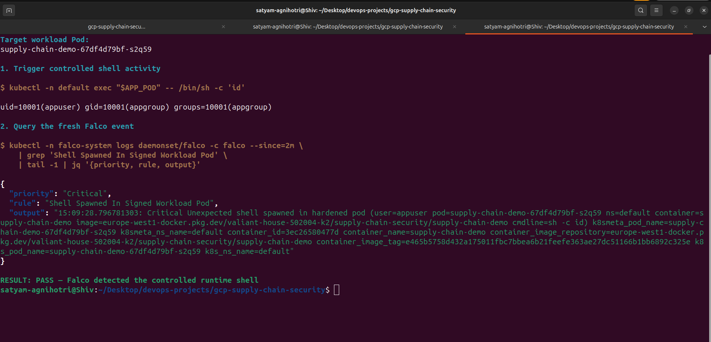

The controlled validation ran `kubectl exec ... /bin/sh -c id` in the admitted workload and queried a fresh Falco event. The output records **Critical**, the custom rule name, the target Pod and namespace, and the shell command. Kyverno permitted the trusted artifact at admission time; Falco then detected suspicious behavior after admission. This distinction is deliberate: Falco detects and reports—it does not claim to block the shell command.

## Security Tests: What Happens When Trust Breaks?

| Scenario | Expected result | Actual result | Evidence |
| --- | --- | --- | --- |
| Trusted signed and attested digest | Admit | PASS | [Server-side admission and live deployment](docs/my-validation/08-trusted-admit.png) |
| Unsigned image in the protected registry scope | Deny | PASS | [Kyverno denial](docs/my-validation/09-unsigned-blocked.png) |
| Wrong signer identity expectation | Deny | PASS | [Temporary wrong-trust policy](docs/my-validation/10-invalid-trust-blocked.png) |
| Wrong provenance source expectation | Deny | PASS | [Temporary wrong-trust policy](docs/my-validation/10-invalid-trust-blocked.png) |
| Signed main container plus untrusted image path | Deny | PASS | [Container-path bypass test](docs/my-validation/11-init-bypass-blocked.png) |
| Unsigned initContainer | Deny | PASS | [initContainer bypass test](docs/my-validation/11-init-bypass-blocked.png) |
| Controlled runtime shell execution | Falco CRITICAL detection | PASS | [Falco event](docs/my-validation/12-falco-runtime.png) |

The wrong-trust test uses a temporary ClusterPolicy that intentionally expects an incorrect signer and source URI for a known signed image, then deletes that policy after the test. It proves the project checks the expected identity and provenance characteristics, not merely the existence of any signature.

The mixed-container and unsigned-initContainer tests are important because verifying only a primary application container could leave an image-field bypass. The fixtures demonstrate that the relevant Pod image fields are covered by the configured policy.

### Unsigned image: denied

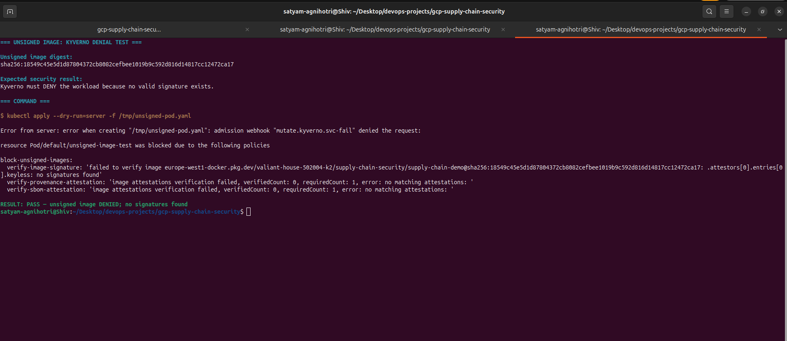

The server-side request uses a real `unsigned-test` image from the protected registry scope. Kyverno denies the Pod because no signature exists and no matching provenance or SBOM attestations are available. This is a real admission decision, not a unit-test assertion.

### Wrong trust contract: denied

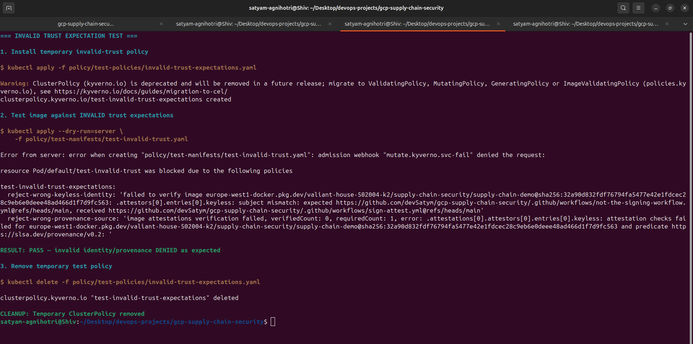

For this controlled negative test, a temporary ClusterPolicy deliberately expects the wrong keyless workflow subject and SLSA source URI. The known signed image is still denied, then the temporary policy is deleted. That proves the policy validates the expected signer and provenance contract instead of accepting any signature.

### Container and initContainer bypass attempts: denied

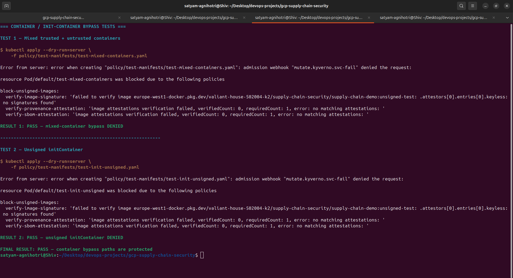

Two separate server-side requests were rejected: a Pod combining a trusted primary image with an untrusted image path, and a Pod with an unsigned initContainer. These tests demonstrate why policy coverage must extend beyond the visible application container.

## Live Validation Evidence

The following matrix connects each published live capture to the control it proves. It does not treat historical upstream files under **docs/evidence** as personal deployment proof.

| Control | Tool | Positive or negative test | Evidence |
| --- | --- | --- | --- |
| PR SAST | Semgrep | Positive PR gate | [PR security-gates capture](docs/my-validation/01-pr-security-gates.png) |
| Filesystem and built-image scanning | Trivy | Positive PR and main gates | [PR gate](docs/my-validation/01-pr-security-gates.png) and [main pipeline](docs/my-validation/02-main-build-pipeline.png) |
| Artifact digest in registry | Artifact Registry | Digest-addressed image | [Registry capture](docs/my-validation/03-gar-image-digest.png) |
| Artifact digest in GKE | Kubernetes | Live Deployment uses reviewed digest | [Live deployment capture](docs/my-validation/03b-live-deployment-digest.png) |
| Keyless signing | Cosign | Expected signer, issuer, certificate, and Rekor verification | [Cosign verification](docs/my-validation/04-cosign-verification.png) |
| SPDX SBOM | Syft and Cosign | Positive attestation verification | [SBOM/provenance capture](docs/my-validation/05-sbom-provenance.png) |
| SLSA provenance | Cosign | Positive provenance verification | [SBOM/provenance capture](docs/my-validation/05-sbom-provenance.png) |
| Cluster security components | GKE | App, Argo CD, Kyverno, Falco, and Falcosidekick running | [Cluster workload capture](docs/my-validation/06-gke-workloads.png) |
| GitOps reconciliation | Argo CD | Healthy, Synced, canonical source, and chart path | [Application tree](docs/my-validation/07-argocd-healthy.png) and [details](docs/my-validation/07-argocd-healthy-details.png) |
| Trusted admission | Kyverno | Positive server-side dry run and running workload | [Admission capture](docs/my-validation/08-trusted-admit.png) |
| Unsigned protected image | Kyverno | Negative denial | [Unsigned-image denial](docs/my-validation/09-unsigned-blocked.png) |
| Wrong identity or provenance | Kyverno | Negative denial | [Wrong-trust denial](docs/my-validation/10-invalid-trust-blocked.png) |
| Container and initContainer paths | Kyverno | Negative bypass tests | [Bypass-test denial](docs/my-validation/11-init-bypass-blocked.png) |
| Runtime shell | Falco | Controlled CRITICAL detection | [Falco event](docs/my-validation/12-falco-runtime.png) |

### Evidence interpretation

- The PR capture comes from the open [PR #4](https://github.com/devSatym/gcp-supply-chain-security/pull/4), where all seven relevant checks passed. It is intentionally unmerged at the time of writing.
- The trusted main run at [32638968765](https://github.com/devSatym/gcp-supply-chain-security/actions/runs/32638968765) completed Build and Push, final-image Trivy, keyless signing, SPDX/SLSA attestation, and strict Verify successfully.
- The live deployment remains a deliberately manual GitOps promotion of a verified digest. A newer verified main artifact is not silently substituted into the chart.
- All validation captures are incorporated into the story at the point where their control is discussed. The two Argo CD captures redact only personal author/account text; none of the committed evidence images contains a credential, token, private key, or webhook.

## Repository Structure

~~~text
.
├── .github/
│   ├── actions/                    Reusable GCP auth, Cosign, Syft, and Docker helpers
│   └── workflows/                  Active PR, artifact, verification, and Terraform CI
├── app/                            FastAPI reference service
├── argocd/                         Argo CD Applications for the happy and manual negative paths
├── docs/
│   ├── codex/                      Audit, validation, handoff, cleanup, resume, and interview notes
│   ├── my-validation/              Personal live-evidence record and privacy-reviewed captures
│   └── repository-merge.md         Canonical monorepo history and attribution record
├── infrastructure/
│   ├── environments/prod/          Terraform deployment root and Falco wiring
│   ├── vpc/                        Private VPC, networking, NAT, and ranges
│   ├── gke/                        Regional private GKE module
│   ├── kubernetes-addons/          Optional metrics-server and ExternalDNS only
│   ├── falco/                      Falco and Falcosidekick Helm module
│   └── falco-alerting/             Optional Pub/Sub, Cloud Function, and Discord route
├── k8s/
│   ├── helm/supply-chain-demo/     Active digest-pinned GitOps chart
│   └── manifests/                  Retained legacy/reference manifests, not the active path
├── policy/
│   ├── kyverno/                    Active admission policy and Helm values
│   ├── test-manifests/             Disposable positive and negative fixtures
│   ├── test-policies/              Temporary wrong-trust test policy
│   └── tests/                      Identity and JMESPath regression tests
├── terraform/                      GitHub ruleset Terraform definition
└── Dockerfile                      Hardened multi-stage application image
~~~

The active deployment flow starts from **k8s/helm/supply-chain-demo**. The direct manifests under **k8s/manifests** and Gatekeeper/Ratify material are retained reference/history content; they are not presented as the active admission or deployment path.

## Infrastructure

The Terraform root is **infrastructure/environments/prod**. It composes reusable modules to provision the relevant infrastructure:

~~~text
Infrastructure
├── Private VPC, subnets, NAT, firewall rules, and flow logs
├── Private regional GKE and node pools
├── Immutable application Artifact Registry repository
├── Separate Cosign metadata Artifact Registry repository
├── GitHub OIDC Workload Identity Federation and dedicated CI identity
├── Read-only Artifact Registry identity for Kyverno through GKE Workload Identity
└── Falco and Falcosidekick
    └── Optional Pub/Sub -> Cloud Function -> Secret Manager -> Discord route
~~~

Remote Terraform state uses GCS with a versioned bucket. The production root requires a two-pass first deployment because the Helm and Kubernetes providers use outputs from the GKE module:

1. apply the required APIs, VPC, and GKE;
2. then apply the full root for GAR, WIF, optional add-ons, and Falco resources.

Kyverno and Argo CD are installed separately with Helm because the executable Kubernetes-addons module does not deploy admission engines. Gatekeeper, Ratify, cert-manager, and ExternalDNS are not part of the active portfolio deployment.

See [the production infrastructure guide](infrastructure/environments/prod/README.md) for the precise module and provider details.

## Azure Startup

The Azure implementation is additive to the GCP reference implementation. Once
the owner has bootstrapped the Azure Blob remote-state backend and is running
from a network that can resolve and reach private AKS, the full Azure rollout is
started with one command:

```bash
scripts/azure/apply-once.sh --mode core
```

The runner uses the configured Azure remote backend, applies saved Terraform
plans, verifies the private AKS control-plane path, and installs the Azure
add-ons and GitOps application. Use `--mode private` only when the required
private endpoints and a private GitHub Actions runner are ready; it closes
public service access only after the prerequisite connectivity checks pass.

See the [Azure startup guide](scripts/azure/README.md) for owner-supplied
inputs and the [Azure status and validation guide](docs/azure/README.md) for
the current live-readiness state.

## CI/CD Workflows

| Workflow | Trigger | Responsibility |
| --- | --- | --- |
| **pr-check.yml** | Pull requests to main | Relevant-path detection, reusable Semgrep/Trivy security scan, and policy tests |
| **security-scan.yml** | Reusable only | Blocking Semgrep and Trivy filesystem scan with SARIF upload |
| **deploy.yml** | Push to main, pull requests to main, manual dispatch | Local unprivileged PR image scan; trusted main/manual orchestration |
| **build-push.yml** | Reusable only | GCP WIF authentication, Buildx build/push, digest output, final Trivy image scan |
| **sign-attest.yml** | Reusable only | Keyless Cosign signature, SPDX SBOM, and SLSA provenance |
| **verify.yml** | Reusable only | Fail-closed signature, SBOM, and provenance validation |
| **sbom-vex.yml** | Reusable only | Supplementary CycloneDX SBOM and reachability artifact; explicitly non-blocking |
| **infrastructure-terraform.yml** | Relevant infrastructure pull requests, main pushes, and manual dispatch | Terraform format, backend-free init, and validate only; never apply |

The retained workflow in **infrastructure/.github/workflows** is historical imported material. GitHub does not execute nested workflow directories, so it is not an active CI path.

## Reproduce or Inspect Safely

### Prerequisites

- Google Cloud CLI and access to your own GCP project
- Terraform 1.7 or newer
- Docker
- kubectl
- Helm
- Cosign
- Python 3.12 for local policy test dependencies
- GitHub CLI if you want to inspect Actions runs or create a PR

### Local application build

~~~bash
git clone https://github.com/devSatym/gcp-supply-chain-security.git
cd gcp-supply-chain-security

docker build \
  --build-arg GIT_SHA="$(git rev-parse --short HEAD)" \
  -t supply-chain-demo:local .

docker run --rm -p 8000:8000 supply-chain-demo:local
curl http://localhost:8000/health
curl http://localhost:8000/info
~~~

This local image is for development only. It is not a trusted, signed deployment artifact.

### Safe local validation

~~~bash
terraform fmt -check -recursive infrastructure terraform
terraform -chdir=infrastructure/environments/prod init -backend=false -input=false
terraform -chdir=infrastructure/environments/prod validate

helm lint k8s/helm/supply-chain-demo
helm template supply-chain-demo k8s/helm/supply-chain-demo \
  > /tmp/supply-chain-demo-rendered.yaml
kubectl apply --dry-run=client -f /tmp/supply-chain-demo-rendered.yaml

bash policy/tests/check-identity-consistency.sh

VALIDATION_TMP="$(mktemp -d)"
python3 -m venv "$VALIDATION_TMP/venv"
"$VALIDATION_TMP/venv/bin/pip" install --quiet jmespath pyyaml
"$VALIDATION_TMP/venv/bin/python" policy/tests/test_jmespath_conditions.py
rm -rf "$VALIDATION_TMP"
~~~

### Deploy to your own GCP project

> **Warning:** applying the production Terraform root creates billable cloud resources. Review every plan and do not copy a real webhook, service-account key, Terraform state, kubeconfig, or GitHub token into this repository.

1. Copy **infrastructure/environments/prod/terraform.tfvars.example** to an ignored **terraform.tfvars** file and set your project-specific, non-secret inputs.
2. Create a versioned GCS state bucket in your project and run Terraform init with your bucket and a state prefix.
3. Review the first Terraform plan. On a new project, apply the API/VPC/GKE targets first, then apply the full root as documented in the [production guide](infrastructure/environments/prod/README.md).
4. Configure the repository variables consumed by the trusted workflow: Artifact Registry location/project/repository, WIF provider, CI service account, and Cosign metadata repository. They are identifiers, not credential material.
5. Update the policy, Helm values, and Argo Application to your own Artifact Registry and canonical GitHub repository identity before enforcing production admission.
6. Install Kyverno with the checked-in values adapted for your own verifier identity, apply the policy only after a trusted artifact exists, and then apply the Argo Application.

For a cluster you own:

~~~bash
gcloud container clusters get-credentials prod-cluster \
  --region <gcp-region> \
  --project <gcp-project-id>

kubectl get nodes
kubectl -n argocd get application supply-chain-demo
kubectl get clusterpolicy block-unsigned-images
~~~

Do not run Terraform destroy as part of normal testing. Use a reviewed destroy plan only when you have intentionally decided to remove the environment and retain the desired evidence first.

## Threat Model and Boundaries

| Threat or failure | Mitigation in this project | Boundary to keep in mind |
| --- | --- | --- |
| Code pattern or dependency issue reaches main | Semgrep, Trivy filesystem scan, policy tests, PR image scan | Scanner coverage is not proof that code has no defect |
| Long-lived cloud credential is copied from CI | GitHub OIDC and repository-scoped GCP WIF | The GitHub workflow and GCP trust configuration are themselves security-critical |
| Mutable tag is repointed | Helm deploys an immutable digest and Kyverno verifies digest | Digest pinning does not decide whether the digest is safe |
| Unsigned artifact is deployed | Cosign keyless verification and Kyverno Enforce | Policy scope applies to the configured protected Artifact Registry images |
| Artifact is signed by an unexpected workflow | Exact signing-workflow subject, issuer, and Rekor expectations | Trust is as strong as the configured identity and its protections |
| Attestation is missing or comes from the wrong build source | SPDX/SLSA predicate checks, builder/entry-point/source checks | SBOM is inventory, not a vulnerability guarantee |
| Untrusted initContainer bypasses a trusted main container | Pod-image-field admission tests | Future Pod types and policy changes need regression testing |
| Interactive shell starts after admission | Falco custom CRITICAL rule | Falco detects and reports; it does not block the process |

## Design Decisions

### Why digest pinning instead of latest?

An image digest is immutable content identity. A tag can be useful for build metadata but can later move; a digest ties the signed, scanned, verified, and deployed artifact to the same bytes.

### Why GitHub OIDC plus GCP Workload Identity Federation?

The main workflow exchanges a short-lived GitHub-issued identity for GCP access. This removes the normal need for a stored CI service-account JSON key and scopes cloud trust to the canonical repository.

### Why keyless Cosign?

Keyless signing binds an artifact signature to workflow identity rather than to a long-lived private key stored in CI. Verification checks the expected identity, issuer, transparency-log evidence, and immutable digest.

### Why both an SBOM and provenance?

The SBOM inventories what is in the artifact. Provenance records who or what built it, from which repository/revision, and with which declared workflow entry point. Neither replaces the other.

### Why Kyverno?

Kyverno natively verifies signatures and attestations in Kubernetes admission. It provides the active enforcement engine for this project; retained Gatekeeper/Ratify content is not deployed.

### Why Argo CD?

Git remains the desired-state record. Argo CD continuously reconciles a reviewed Helm configuration rather than allowing CI to imperatively deploy a mutable image.

### Why Falco after Kyverno?

Kyverno decides whether an artifact can start. Falco observes what an admitted workload does after it starts. The two controls operate at different times and address different failure modes.

### Why a separate PR and main trust boundary?

Pull-request code should not receive production WIF, registry-push, signing, attestation, or deployment authority. It can still receive meaningful, non-privileged security feedback through local scans and policy tests.

## Current Scope and Future Improvements

This is a live, security-focused reference workload rather than a customer-facing application platform. The current scope is intentionally narrow and transparent:

- one active GKE environment and a simple demo service;
- reviewed manual GitOps digest promotion rather than CI automatically committing deployment state;
- no active fail-closed Terraform/Kubernetes misconfiguration gate yet, because the repository needs a reviewed baseline for real infrastructure findings and deliberately insecure negative fixtures;
- GitHub ruleset Terraform is defined but not applied; branch-protection changes require explicit review because they can affect recovery;
- Falco and Falcosidekick are deployed, but external Discord delivery remains disabled until a real webhook is supplied privately;
- no public ingress, custom domain, service mesh, multi-cluster deployment, full SIEM, or observability platform is claimed;
- imported Gatekeeper/Ratify and other upstream reference files remain preserved but are not active controls.

Useful follow-on improvements include baselining a version-pinned IaC/config scanner, enabling reviewed branch protection, adding further redacted validation captures as the project evolves, adding a controlled external alert destination, and introducing multi-environment promotion only if the project scope expands.

The full current CI gap assessment is in [docs/codex/12-CI-GAP-MATRIX.md](docs/codex/12-CI-GAP-MATRIX.md).

## Cost and Cleanup

The main live cost drivers are regional GKE capacity, node and disk resources, Cloud NAT, VPC flow logs, Artifact Registry storage and egress, and logging. Preserve the trusted artifact, evidence, and negative-test proof before cleanup.

The disposable unsigned Artifact Registry image should be deleted only after its denial evidence is safely retained. Manual Helm releases, Kyverno, and Argo CD should be considered before any reviewed Terraform teardown. See the [cost and cleanup guide](docs/codex/07-COST-AND-CLEANUP.md) for the ordered cleanup procedure.

## What This Project Demonstrates

- Terraform-managed GCP networking, GKE, Artifact Registry, IAM, and Workload Identity Federation
- GitHub Actions trust-boundary design for untrusted pull requests and trusted main builds
- Semgrep and Trivy security gates for source, filesystem, and final image layers
- Keyless Cosign/Sigstore signing, SPDX SBOM generation, SLSA provenance, and strict verification
- GitOps deployment through Argo CD with digest-pinned Helm state
- Kyverno signature, SBOM, provenance, source-identity, and initContainer enforcement
- Falco modern eBPF runtime detection and Falcosidekick integration
- Debugging and proving negative admission outcomes instead of only showing a happy path
