# GCP Supply-Chain Security

An end-to-end software supply-chain security demonstration for the canonical
repository [`devSatym/gcp-supply-chain-security`](https://github.com/devSatym/gcp-supply-chain-security).
GitHub Actions builds and scans an image, signs the immutable digest with
Sigstore keyless identity, attaches SPDX and SLSA attestations, verifies them,
and deploys the digest through Argo CD. Kyverno enforces the trust policy at
admission; Falco observes runtime behavior after admission.

The live implementation was validated on 2026-08-23 in GCP project
`valiant-house-502004-k2`, region `europe-west1`.

## Verified live result

| Component | Result |
| --- | --- |
| GKE | Private regional `prod-cluster`, healthy workloads |
| GAR | Immutable primary image repository plus separate Cosign metadata repository |
| CI | Unprivileged PR gates; WIF-authenticated main build, Trivy, Cosign, SPDX, SLSA, and Rekor verification |
| GitOps | Argo CD Application `Synced/Healthy` |
| Admission | Kyverno 1.19.0 `Enforce`, signature/SBOM/provenance/digest checks |
| Runtime | Falco 0.44.1 modern eBPF; custom shell rule fired at CRITICAL |
| External alert | Disabled until a real Discord webhook is supplied |

Deployed image:

```text
europe-west1-docker.pkg.dev/valiant-house-502004-k2/supply-chain-security/supply-chain-demo@sha256:32a90d832fdf76794fa5477e42e1fdcec28c9eb6e0deee48ad466d1f7d9fc563
```

The deployed digest was produced by GitHub run `32630716371` for commit
`9bf574c`. The latest hardened main-chain validation is
[`32638968765`](https://github.com/devSatym/gcp-supply-chain-security/actions/runs/32638968765)
for merge commit `27a94b0`: Build and Push, final-image Trivy, keyless
signing, SPDX/SLSA attestations, and strict verification all passed. It
produced verified digest
`sha256:a0073f8f1d73f62ab0a15634a48387e78f6f837cff80f27a5c6e3b0a5c1eb16a`;
the deployed digest above remains the deliberately manual GitOps promotion.

## Trust architecture

```mermaid
flowchart LR
  PR[Pull request] --> Gates[Semgrep + Trivy + policy tests]
  Gates --> Main[main]
  Main --> OIDC[GitHub OIDC]
  OIDC --> WIF[GCP Workload Identity Federation]
  WIF --> GAR[Immutable GAR image]
  GAR --> Scan[Trivy image scan]
  Scan --> Sig[Cosign keyless signature]
  Sig --> Att[SPDX SBOM + SLSA provenance]
  Att --> Verify[CI verification]
  Verify --> Argo[Argo CD]
  Argo --> Kyverno[Kyverno Enforce]
  Kyverno --> GKE[Running digest]
  GKE --> Falco[Falco eBPF]
```



The primary GAR repository is immutable:

```text
europe-west1-docker.pkg.dev/valiant-house-502004-k2/supply-chain-security
```

Cosign v2 legacy `.sig` and `.att` indexes use this separate mutable repository:

```text
europe-west1-docker.pkg.dev/valiant-house-502004-k2/supply-chain-security-attestations/supply-chain-demo
```

The metadata repository is only an appendable index. Signatures and
attestations are verified against the immutable primary digest, canonical
GitHub Actions subject, issuer, Rekor, builder, workflow entrypoint, and source
URI.

## Azure startup

The Azure implementation is additive to the GCP reference implementation. Once
the owner has bootstrapped the Azure Blob remote-state backend and is running
from a network that can resolve and reach private AKS, the full Azure rollout is
started with one command:

```bash
scripts/azure/apply-once.sh --mode core
```

The runner uses the configured Azure remote backend, applies saved Terraform
plans, verifies the private AKS control-plane path, and installs the Azure
add-ons and GitOps application. Use `--mode private` only when the required
private endpoints and a private GitHub Actions runner are ready; it closes
public service access only after the prerequisite connectivity checks pass.

See the [Azure startup guide](scripts/azure/README.md) for owner-supplied
inputs and the [Azure status and validation guide](docs/azure/README.md) for
the current live-readiness state.

## Repository map

```text
app/                               FastAPI demo
Dockerfile                         Hardened multi-stage image
.github/workflows/                 PR, build, sign, verify, deploy workflows
.github/actions/                   Reusable WIF, Cosign, Syft helpers
policy/kyverno/                    Active admission policy and Helm values
policy/test-manifests/             Disposable positive/negative fixtures
policy/test-policies/              Test-only wrong-trust policy
k8s/helm/supply-chain-demo/        Active Argo CD Helm source
k8s/manifests/                     Retained unreferenced legacy examples
argocd/                             Committed Argo CD Applications
infrastructure/environments/prod/  Terraform deployment root
infrastructure/vpc,gke/...        Imported infrastructure modules
infrastructure/falco/              Falco/Falcosidekick Terraform module
terraform/                          GitHub ruleset Terraform configuration
docs/codex/                         Audit, plan, validation, handoff, cleanup
docs/my-validation/                 Personal live evidence
```

`infrastructure/` is the imported infrastructure component from
`musaumakau/gcp-infrastructure-modules`; the application/security component was
originally attributed to `musaumakau/supply-chain-security`. Those are
historical source attributions, not active runtime identities. See
[`docs/repository-merge.md`](docs/repository-merge.md).

## GitHub repository variables

These are variables, not secrets. They are configured on the canonical GitHub
repository:

| Variable | Value |
| --- | --- |
| `GAR_LOCATION` | `europe-west1` |
| `GAR_PROJECT_ID` | `valiant-house-502004-k2` |
| `GAR_REPOSITORY` | `supply-chain-security` |
| `GCP_SA_EMAIL` | `supply-chain-ci@valiant-house-502004-k2.iam.gserviceaccount.com` |
| `GCP_WORKLOAD_IDENTITY_PROVIDER` | `projects/747109416512/locations/global/workloadIdentityPools/supply-chain-github-pool/providers/github-provider` |
| `COSIGN_REPOSITORY` | `europe-west1-docker.pkg.dev/valiant-house-502004-k2/supply-chain-security-attestations/supply-chain-demo` |

No CI service-account JSON key is used. The WIF provider condition is scoped to
`devSatym/gcp-supply-chain-security`.

## CI security behavior

On a relevant pull request, the pipeline runs change detection, Semgrep, Trivy
filesystem scanning, policy tests, and a local Docker image build plus Trivy
image scan. It does not obtain a GitHub OIDC token, authenticate to GCP, push
to GAR, sign, attest, modify Git, or deploy. The skipped production jobs shown
under `Deploy` on a PR are therefore intentional security controls.

On a push to `main` (or a manually confirmed dispatch that is explicitly on
`main`), the trusted sequence is:

```text
Build/push → exact-digest Trivy scan → keyless signature → SPDX SBOM
→ SLSA provenance → strict signature/SBOM/provenance verification
```

The CI verifier requires the exact signer identity, GitHub OIDC issuer,
immutable subject digest, SPDX predicate, SLSA predicate, GitHub Actions
builder, `sign-attest.yml` entrypoint, canonical source URI, and source commit.
Promotion to the Helm digest is deliberately a reviewed manual GitOps step;
Argo CD deploys only that digest and Kyverno independently checks the same
trust contract at admission.

## Terraform and GCP

Terraform state is stored remotely:

```bash
terraform -chdir=infrastructure/environments/prod init -reconfigure -input=false \
  -backend-config='bucket=valiant-house-502004-k2-gcp-supply-chain-tfstate' \
  -backend-config='prefix=gcp-supply-chain-security/prod'
terraform -chdir=infrastructure/environments/prod validate
terraform -chdir=infrastructure/environments/prod plan
```

The local `infrastructure/environments/prod/terraform.tfvars` is ignored and
contains the approved project/region and non-secret sizing inputs. Never commit
that file, state, a kubeconfig, or a webhook. The final live plan reported
`No changes`.

The executable Kubernetes add-ons module installs only optional metrics-server
and ExternalDNS. Kyverno is installed separately by Helm. Gatekeeper/Ratify,
cert-manager, ExternalDNS, and legacy Ratify key resources are not part of the
final deployment.

## Install or inspect cluster services

Kyverno is installed with the checked-in values, including its GKE Workload
Identity annotation:

```bash
helm upgrade --install kyverno kyverno/kyverno \
  --namespace kyverno --create-namespace --version 3.9.0 \
  --values policy/kyverno/values.yaml --wait
```

Argo CD was installed from the official `argo-cd` chart (app version 3.5.1),
and the active Application is:

```bash
kubectl apply -f argocd/supply-chain-demo-app.yaml
kubectl get application -n argocd supply-chain-demo
```

Falco is Terraform-managed. It uses modern eBPF and the custom rule in the
prod root. Falcosidekick has no static credentials. Pub/Sub/Cloud Function/
Discord is guarded by `enable_runtime_alerting` and requires a real Discord
incoming-webhook URL in ignored local input.

## Admission tests

The active policy is `policy/kyverno/block-unsigned-images.yaml`. It requires
all of the following for GAR application images:

- Cosign keyless signature with the canonical `sign-attest.yml` subject,
  GitHub OIDC issuer, and Rekor;
- digest verification;
- SPDX SBOM attestation;
- SLSA v0.2 provenance with the GitHub runner builder, `sign-attest.yml`
  entrypoint, and canonical monorepo source URI.

The positive chart render is admitted through the API server. The real
`unsigned-test` image, mixed-container fixture, and unsigned-init fixture are
denied. The wrong-trust policy in `policy/test-policies/` is test-only: apply it
briefly with the matching fixture to demonstrate wrong signer/source rejection,
then delete the temporary ClusterPolicy.

## Manual Cosign verification

Cosign must be told where legacy metadata indexes live:

```bash
export REGISTRY='europe-west1-docker.pkg.dev/valiant-house-502004-k2/supply-chain-security/supply-chain-demo'
export DIGEST='sha256:32a90d832fdf76794fa5477e42e1fdcec28c9eb6e0deee48ad466d1f7d9fc563'
export COSIGN_REPOSITORY='europe-west1-docker.pkg.dev/valiant-house-502004-k2/supply-chain-security-attestations/supply-chain-demo'
export CERT_IDENTITY='https://github.com/devSatym/gcp-supply-chain-security/.github/workflows/sign-attest.yml@refs/heads/main'
export OIDC_ISSUER='https://token.actions.githubusercontent.com'

cosign verify \
  --certificate-identity="$CERT_IDENTITY" \
  --certificate-oidc-issuer="$OIDC_ISSUER" \
  "$REGISTRY@$DIGEST"

cosign verify-attestation \
  --certificate-identity="$CERT_IDENTITY" \
  --certificate-oidc-issuer="$OIDC_ISSUER" \
  --type spdxjson "$REGISTRY@$DIGEST"

cosign verify-attestation \
  --certificate-identity="$CERT_IDENTITY" \
  --certificate-oidc-issuer="$OIDC_ISSUER" \
  --type slsaprovenance "$REGISTRY@$DIGEST"
```

## Local development

```bash
docker build --build-arg GIT_SHA=$(git rev-parse --short HEAD) \
  -t supply-chain-demo:local .
docker run --rm -p 8000:8000 supply-chain-demo:local
curl http://localhost:8000/health
curl http://localhost:8000/info
```

## Cost and cleanup

The live cost drivers are regional GKE, node/disk capacity, Cloud NAT, flow
logs, and GAR storage/egress. Keep evidence first, then delete the disposable
`unsigned-test` GAR version if no longer needed. Only after explicit approval,
uninstall Argo/Kyverno and run a reviewed Terraform destroy. See
[`docs/codex/07-COST-AND-CLEANUP.md`](docs/codex/07-COST-AND-CLEANUP.md).

## Evidence and interview material

- [`docs/my-validation/README.md`](docs/my-validation/README.md) — personal
  live validation record.
- [`docs/codex/03-VALIDATION.md`](docs/codex/03-VALIDATION.md) — matrix of
  passed, pending, and input-blocked checks.
- [`docs/codex/09-RESUME-MATERIAL.md`](docs/codex/09-RESUME-MATERIAL.md) —
  resume bullets.
- [`docs/codex/10-INTERVIEW-GUIDE.md`](docs/codex/10-INTERVIEW-GUIDE.md) —
  architecture explanations and honest limitations.

## History safety

The current merge topology is canonical and documented. Implementation commits
are additive descendants of `main`; no history repair, rebase, filter, replace,
cherry-pick, reset, or force-push was performed.
