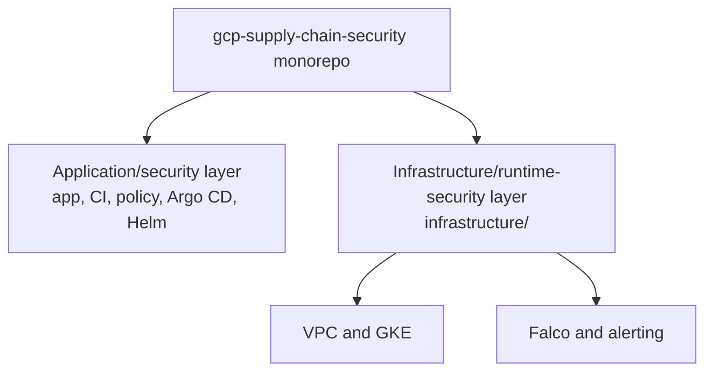
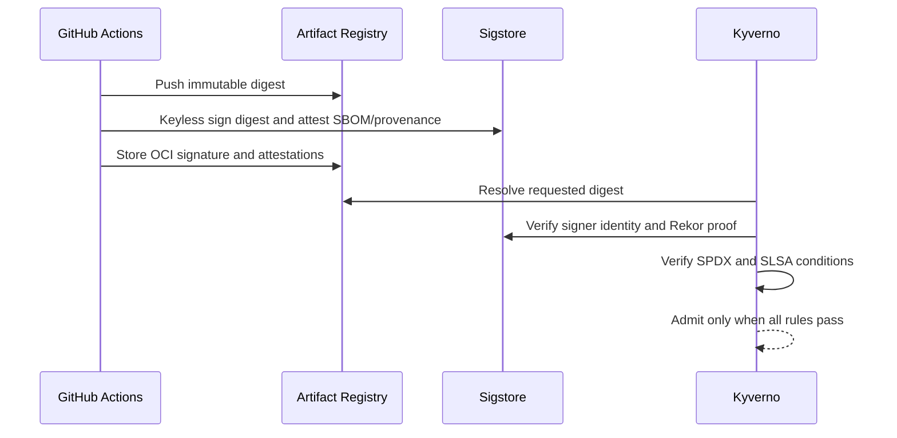
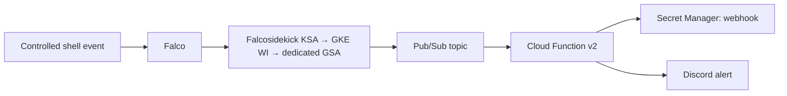
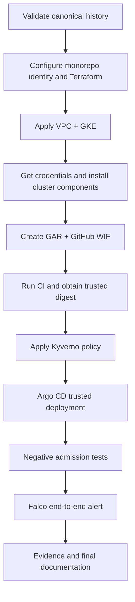

# Implementation Plan

Status: Phase 0 history gate passed. The canonical topology is documented in [the audit](00-REPO-AUDIT.md) and [`docs/repository-merge.md`](../repository-merge.md). Implementation begins additively from the current `main` history.

## Component boundary

## Target architecture

```mermaid
flowchart LR
  PR[Pull request] --> Scan[Semgrep + Trivy filesystem]
  Scan --> Main[Protected main]
  Main --> OIDC[GitHub OIDC]
  OIDC --> WIF[GCP WIF]
  WIF --> GAR[Artifact Registry\nSHA tag + digest]
  GAR --> Trivy[Trivy image scan]
  Trivy --> Cosign[Keyless Cosign signature\nSPDX SBOM + SLSA provenance]
  Cosign --> Verify[CI verification]
  Verify --> GitOps[Argo CD]
  GitOps --> Kyverno[Kyverno Enforce]
  Kyverno --> GKE[GKE trusted workload]
  GKE --> Falco[Falco]
  Falco --> Sidekick[Falcosidekick via GKE WI]
  Sidekick --> PubSub[Pub/Sub]
  PubSub --> Function[Cloud Function]
  Function --> Discord[Discord]
```

## Artifact trust chain

## Runtime alerting chain

## Deployment sequence

## Phases

| Phase | Objective / current state | Required changes and affected files | Commands and resources | Validation / failure mode / rollback | Human action and cost |
| --- | --- | --- | --- | --- | --- |
| 0. Canonical history validation | Verify the current canonical merge baseline. Current state: passed. | Correct stale merge documentation and tracking references; do not modify history. | `git cat-file`, `git show --pretty=raw`, and `git merge-base --is-ancestor` against `6717e449…` and its two parents. | The merge has exactly two parents and both are ancestors of `HEAD`. Failure: stop and investigate; rollback: documentation-only revert. | No human action or cloud cost. |
| 1. Monorepo identity | Make `devSatym/gcp-supply-chain-security` the one runtime identity. | Adapt CODEOWNERS, Renovate, Docker OCI label, root GitHub ruleset, CI variables and identity fixtures; preserve historical evidence. | `git remote get-url origin`, GitHub CLI/API after authentication. | No runtime configuration contains old owner/project except preserved history/docs. Failure: unclassified stale reference. | GitHub authentication is required; no cloud cost. |
| 2. Terraform readiness | Make `infrastructure/environments/prod` safe for the intended project. | Parameterize backend; add GAR, required services, dedicated CI WIF/GSA, and Falcosidekick WI binding; disable ExternalDNS/Gatekeeper/Ratify deployment; pin provider majors compatible with the Helm provider syntax. | `terraform fmt`, `init`, `validate`, `plan`; creates GCS state bucket only after user confirms target project. | Plan has explained add/change/destroy counts. Failure: provider/API/IAM error; rollback: revert un-applied config. | Project, billing, region, state-bucket choice required. NAT, GKE, nodes, and logging cost money. |
| 3. GKE base | Provision usable VPC and GKE. | Supported `terraform.tfvars` only; no secrets committed. | First target VPC/GKE apply if code still requires it, then normal apply; fetch credentials. | Nodes Ready and system pods healthy. Failure: quota, stockout, private endpoint access; rollback: Terraform destroy only with explicit user approval. | Billing/quota approval; GKE, disks, NAT costs. |
| 4. Cluster services | Install only final-scope services. | Helm-install Kyverno and Argo CD in `kyverno` and `argocd`; configure Kyverno context limit only if tested necessary. | `helm repo add/update`, `helm upgrade --install`, `kubectl get pods -A`. | Controllers healthy before policy enforcement. Failure: webhook availability/context size; rollback: Helm uninstall only with explicit approval. | No separate licence cost; consumes cluster resources. |
| 5. CI WIF and artifact path | Enable keyless GitHub-to-GCP authentication and immutable delivery. | Create repo-scoped GAR repository, WIF pool/provider condition for the canonical repository, CI SA and least privilege IAM; update CI GAR envs and GitHub variables. | Terraform/GitHub variable commands; push a normal branch/PR. | CI exchanges OIDC token without a JSON key, pushes SHA-tagged image, and records digest. Failure: issuer/attribute/IAM mismatch; rollback: remove newly created bindings/resources. | GitHub auth and GCP IAM authority required; GAR storage/network cost. |
| 6. Artifact trust | Produce and verify personal signature, SPDX SBOM, and SLSA provenance. | Keep digest flow; update Kyverno subject/image scope/source URI and matching fixture after the first personal build. | Trigger `deploy.yml`; `cosign verify` and `cosign verify-attestation`. | Signature, SBOM, and provenance pass against the exact digest. Failure: identity, workflow path, Rekor, or predicate mismatch; rollback: do not apply policy. | Sigstore availability required; no static signing key. |
| 7. GitOps admission | Admit only the personal trusted digest. | Update Helm `values.yaml` and both Argo `repoURL` values; apply Kyverno policy only after verification. | Apply Argo Application, inspect sync/health, port-forward application. | Trusted pod is admitted and `/`, `/health`, `/info` respond. Failure: policy rejection; diagnose identity/digest/attestation, never weaken Enforce. | No additional authority beyond cluster access. |
| 8. Negative admission matrix | Prove each guard works under the protected GAR scope. | Use disposable manifests/artifacts; retain historical test files. | Attempt unsigned, wrong identity/provenance, and unsigned initContainer admissions. | Expected blocks recorded verbatim. Failure: any pod is admitted; stop and fix policy. | Some temporary GAR storage; delete only with explicit user decision. |
| 9. Runtime security | Deploy Falco and prove alert delivery without a static Falcosidekick key. | Bind chart KSA to dedicated Pub/Sub publisher GSA; use chart WI value; keep Discord webhook in local tfvars/Secret Manager. | Terraform apply, controlled shell execution, inspect Falco/Sidekick/Pub/Sub/Function logs. | One controlled rule, alert timestamp, and Discord notification. Failure: KSA/GSA/IAM/configuration mismatch; rollback by removing newly added binding/release only with approval. | Discord webhook creation required; Pub/Sub, function, storage cost. |
| 10. Closeout | Publish only evidence-backed claims. | Create personal evidence/screenshots, README, resume, interview guide, resource inventory, cleanup guide. | Final `fmt`, `validate`, plan, Git ancestry checks, CI/GKE/Argo/Falco inspections. | Validation matrix complete with actual evidence links. Failure: untested claim stays pending. | User approves any cleanup/destroy; retain final digest by default. |

## Non-negotiable controls

- Do not rewrite, rebase, filter, or force-push history.
- Do not commit `terraform.tfvars`, state, a Discord webhook, GCP JSON key, kubeconfig, PAT, or generated token.
- Do not activate Gatekeeper/Ratify, VEX enforcement, ExternalDNS, cert-manager, a service mesh, or an observability stack for this portfolio deployment.
- Do not apply Kyverno Enforce policy before a personal trusted digest exists.
- Do not use a CI service-account key if WIF fails.
