# Implementation Plan

Status: implementation is live through the signed GitOps workload and Falco
runtime detection. The remaining work is evidence/closeout plus the optional
external Discord and PR-gate steps. All work is additive from the current
canonical `main` history.

## Target architecture

```mermaid
flowchart LR
  PR[Pull request] --> Scan[Semgrep + Trivy filesystem]
  Scan --> Main[Protected main]
  Main --> OIDC[GitHub OIDC]
  OIDC --> WIF[GCP Workload Identity Federation]
  WIF --> GAR[Immutable GAR digest]
  GAR --> ImageScan[Trivy image scan]
  ImageScan --> Cosign[Cosign keyless signature + SPDX + SLSA]
  Cosign --> Verify[CI verification]
  Verify --> Argo[Argo CD]
  Argo --> Kyverno[Kyverno Enforce]
  Kyverno --> GKE[Trusted workload]
  GKE --> Falco[Falco modern eBPF]
```



The optional final edge is Falcosidekick KSA → GKE Workload Identity → Pub/Sub
→ Cloud Function → Secret Manager → Discord. It remains disabled until a real
Discord webhook is supplied.

## Phase status

| Phase | State | Evidence / next action |
| --- | --- | --- |
| 0. Canonical history | Complete | Current merge and both parents verified; no history operation performed |
| 1. Monorepo identity | Complete | Active runtime references use `devSatym/gcp-supply-chain-security`; attribution/evidence preserved |
| 2. Terraform readiness | Complete | Prod root formatted/validated; WIF, GAR, Kyverno reader, and backend are configured |
| 3. GCP foundation | Complete | VPC, NAT, firewall, GKE, APIs, state bucket, and node-pool IAM applied |
| 4. Cluster services | Complete | Kyverno 1.19.0 and Argo CD 3.5.1 healthy; Falco 0.44.1 live |
| 5. CI WIF and GAR | Complete | GitHub variables set; workflow `32630716371` passed build, scan, sign, attest, verify |
| 6. Artifact trust | Complete | Deployed digest has keyless signature, SPDX SBOM, SLSA provenance, and Rekor verification |
| 7. GitOps admission | Complete | Argo Application `Synced/Healthy`; signed digest deployed through Helm |
| 8. Negative admission matrix | Complete | Unsigned, mixed/init-container, and wrong identity/provenance fixtures denied |
| 9. Runtime security | Partial | Falco custom shell rule fired; Pub/Sub/Discord delivery awaits webhook input |
| 10. Closeout | In progress | Update README, evidence, handoff, resume/interview material, and cleanup guidance |

## Non-negotiable controls

- Do not rewrite, rebase, filter, replace, cherry-pick, reset, or force-push Git history.
- Never commit `terraform.tfvars`, Terraform state, kubeconfig, PATs, webhooks,
  JSON service-account keys, or generated tokens.
- Keep the primary GAR repository immutable; use the separate mutable Cosign
  metadata repository only for legacy Cosign index append operations.
- Keep Kyverno `Enforce`, `verifyDigest`, signature/SBOM/provenance requirements,
  Rekor verification, and canonical signer/source conditions intact.
- Do not activate Gatekeeper/Ratify, cert-manager, ExternalDNS, VEX enforcement,
  or an observability stack outside the approved scope.

## Exact live inputs

```text
GCP project: valiant-house-502004-k2 (747109416512)
Region: europe-west1
GKE cluster: prod-cluster
Terraform state: gs://valiant-house-502004-k2-gcp-supply-chain-tfstate
State prefix: gcp-supply-chain-security/prod
Application digest: sha256:32a90d832fdf76794fa5477e42e1fdcec28c9eb6e0deee48ad466d1f7d9fc563
```

The final Terraform plan reports no changes. Any future `terraform destroy`,
negative-artifact deletion, or ruleset activation requires an explicit review
of the resulting external impact.
